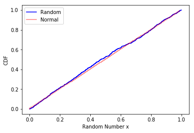

[Think Stats Chapter 4 Exercise 2](http://greenteapress.com/thinkstats2/html/thinkstats2005.html#toc41) (a random distribution)

```python
#PMF generation
rands=np.random.random(1000)

pmf = thinkstats2.Pmf(rands)
thinkplot.Pmf(pmf, linewidth=0.1)
thinkplot.Config(xlabel='Random variate', ylabel='PMF')

#CDF distribution
import matplotlib.pyplot as plt
rands.sort()
siz=len(rands)
y=np.arange(0,1,1/1000)
plt.step(rands,y,'b-',label='Random')
plt.step(np.arange(0,1,0.01),np.arange(0,1,0.01),'r--',alpha=0.5,label='Normal')
plt.xlabel('Random Number x')
plt.ylabel('CDF')
plt.legend()
plt.show()
```

>>The random function is almost perfectly normal but some noise exists.

